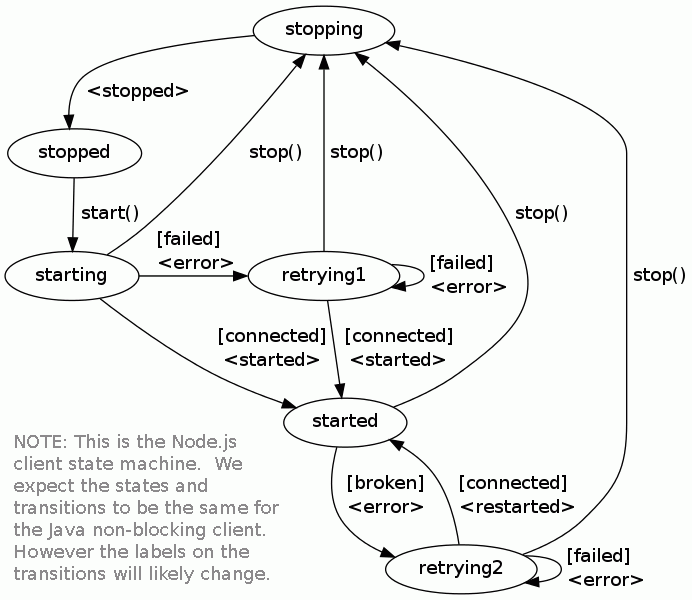

# IBM MQ Light Java

[![Maven version][maven-img]][maven-url]

## Non-blocking API

Example code for using the non-blocking client to send a message

```java
NonBlockingClient.create("amqp://localhost", new NonBlockingClientAdapter() {
  public void onStarted(NonBlockingClient client, Void context) {
    SendOptions opts = SendOptions.builder().setQos(QOS.AT_LEAST_ONCE).build();
    client.send("/public", "Hello World!", null, opts, new CompletionListener<Void>() {
      public void onSuccess(NonBlockingClient client, Void context) {
        client.stop(null, null);
      }
      public void onError(NonBlockingClient client, Void context, Exception exception) {
        client.stop(null, null);
      }
    }, null);
  }
  public void onDrain(NonBlockingClient client, Void context) {}
}, null);
```

Example code for receiving messages published to the '/public' topic.

```java
NonBlockingClient client = NonBlockingClient.create("amqp://localhost", null, null);
client.subscribe("/public", new DestinationAdapter() {
  public void onMessage(NonBlockingClient client, Void context, Delivery delivery) {
    switch (delivery.getType()) {
      case BYTES:
        BytesDelivery bd = (BytesDelivery)delivery;
        System.out.println(bd.getData());
        break;
      case STRING:
        StringDelivery sd = (StringDelivery)delivery;
        System.out.println(sd.getData());
        break;
    }
  }
}, null, null);
```

State machine that underpins the client:  


## Getting started

The client depends on the following jar files (and has been built and tested
using the indicated versions):

Dependency      | Version  
--------------- | -------------
Google Gson     | 2.2.4
Logback Classic | 1.1.2
Logback Core    | 1.1.2
Apache Netty    | 4.0.21.Final
SLF4J           | 1.7.5
Stateless4J     | 2.5.0

The client can be installed into a Maven repository and automatically resolve these dependencies. For example:
    
```
mvn org.apache.maven.plugins:maven-install-plugin:2.5.2:install-file -Dfile=mqlight-api-$version.jar
mvn dependency:get -Dartifact=com.ibm.mqlight.api:mqlight-api:$version
```

The client includes 'maven_install.sh' (for Linux) and 'maven_install.cmd' (for Windows) scripts to perform the
above maven install step, and additionally installs the samples.

## Plug-points for extending the client

The client implements a number of its components in such a way as they can be
replaced by alternative implementations.

The following table describes the various plug-points provided by the client.
For more information about an individual plug-point, please consult the
Javadoc for the relevant interface.

Interface                                    | Description                                                                                                                                                                                                                                        | Supplied implementations
-------------------------------------------- | -------------------------------------------------------------------------------------------------------------------------------------------------------------------------------------------------------------------------------------------------- | ------------------------------------------------------------------------------------------------------------------------------------------------------------------------------------------------------------------------------------------------------------------------------------------------------------------------------------------------------------------------------------------------------------------------------------------------------------------------------------------------------------------------------------------------------------------------------------
com.ibm.mqlight.api.callback.CallbackService | A plug point for the code that is run each time the client needs to call back into application code.                                                                                                                                               | The client supplies two implementations. The first is: com.ibm.mqlight.api.callback.impl.SameThreadCallbackService, which calls back into application code using whatever thread calls in to the plug-point. This introduces minimal overhead on running callbacks - but is not suitable for callbacks that block. The second implementation is: com.ibm.mqlight.api.callback.impl.ThreadPoolCallbackService which schedules callbacks into a threadpool. The default is com.ibm.mqlight.api.callback.impl.ThreadPoolCallbackService.
com.ibm.mqlight.api.endpoint.EndpointService | A plug point for determining the location of the MQ Light server (or service) to connect to.                                                                                                                                                       | The client supplies two implementations, which can be chosen between depending on the value of the `service` parameter passed into the `create` method used to create the client. The first implementation is: com.ibm.mqlight.api.impl.endpoint.SingleEndpointService, which always returns the same endpoint details and is useful when connecting to the stand-alone MQ Light server. The second implementation is: com.ibm.mqlight.api.impl.endpoint.BluemixEndpointService, which (as the name suggests) looks up instances of the MQ Light service in the Bluemix environment.
com.ibm.mqlight.api.network.NetworkService   | A plug point for interfacing with the network used between the MQ Light client and server.                                                                                                                                                         | The client supplies an Apache Netty-based implementation: com.ibm.mqlight.api.impl.network.NettyNetworkService
com.ibm.mqlight.api.timer                    | A plug point for scheduling work to be done at some point in the future. The client uses this to implement inactivity timeouts for the AMQP protocol, and also a delay between repeated attempts to establish connectivity to the MQ Light server. | The client supplies an implementation based on ScheduledThreadPoolExecutor: com.ibm.mqlight.api.impl.timer.TimerServiceImpl
  
## Some notes on logging

The client logs using the SLF4J interfaces. If it is used in a runtime where
an implementation of SLF4J has already been started, then it will use this for
logging. If it is used in a runtime where Logback is used to implement SLF4J
and the LogManager has not been started then it will configure Logback itself.
Currently this involves enabling WARN and above logging unless the
MQLIGHT_JAVA_LOG environment variable is set in which case the level it
specifies will be enabled using Logback's BasicConfigurator. There are also
the following environment variables that can be set to control the logging
behavior when MQLIGHT_JAVA_LOG has been set:

* MQLIGHT_JAVA_LOG_STREAM can be set to specify the log output. By default log
  output up to and including the debug level goes to stdout, and trace level
  goes to stderr. MQLIGHT_JAVA_LOG_STREAM can be set to a file path prefix to
  direct log output to log files named in the following format:
   - {file path prefix}%i.log - for log output up to and including the debug level.
   - {file path prefix}%i.trc - for log output of the trace level.
   
  where %i is blank for the current log file and an index number, starting at
  1, for archive log files.

  A Logback RollingFileAppender with a FixedWindowRollingPolicy and
  SizeBasedTriggeringPolicy is used to ensure the current log file does not
  exceed a certain size (the default is 20 MB) and is rolled over to an archive
  file to start a fresh log file. By default up to 5 archived log files are
  kept, the oldest is deleted when required to make room for a new archive file.
  
  MQLIGHT_JAVA_LOG_STREAM can also be set to stdout or stderr to direct all log
  output to stdout or stderr as required.

* MQLIGHT_JAVA_LOG_FILE_COUNT can be set to specify the number of archive log
  files that should be kept, when MQLIGHT_JAVA_LOG_STREAM is specified as a file
  path prefix.

* MQLIGHT_JAVA_LOG_FILE_LIMIT can be set to specify the maximum size of the log
  files when MQLIGHT_JAVA_LOG_STREAM is specified as a file path prefix. The
  value can be specified in bytes, kilobytes, megabytes, or gigabytes by
  suffixing a numeric value with KB, MB, and GB respectively.

* MQLIGHT_JAVA_LOG_TRACE_ARG_MAX_BYTES can be set to specify the maximum number
  of bytes output for each argument, truncating any over length arguments from
  the right.  By default the maximum number of bytes output for each argument
  is 1024.
  
## Current limitations

* No support for dispatching application callbacks into a pool of threads.
  Callbacks are run on whatever thread needs to call back into application
  code - which is not a good fit for some workloads.

-- 
[maven-url]: https://search.maven.org/#search%7Cga%7C1%7Cmqlight
[maven-img]: https://img.shields.io/maven-central/v/com.ibm.mqlight/mqlight-api.svg

